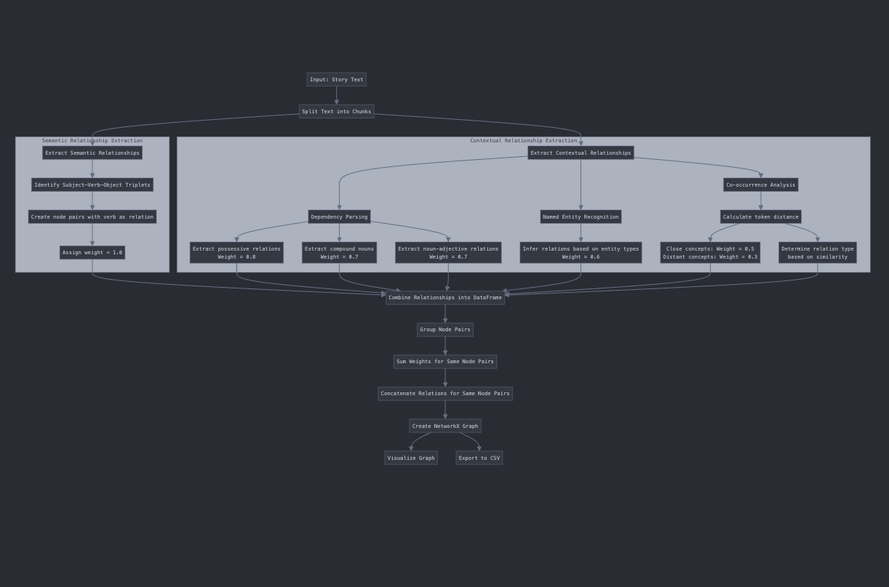

# STARK-QA

## 1. RAG

Our Retrieval-Augmented Generation (RAG) system is designed to work with short stories. It combines the power of embedding-based retrieval and language model generation to provide contextually relevant responses to user queries. The system is optimized for narrative text and can analyze themes, find similar stories, and generate responses based on retrieved context.

### Features
- **Text Processing**: Cleans and chunks text into manageable pieces for efficient processing.
- **Embedding-Based Retrieval**: Uses Sentence Transformers and FAISS for semantic similarity search.
- **RAG Pipeline**: Combines retrieval with a language model to generate context-aware responses.
- **Theme Analysis**: Identifies literary themes in stories.
- **Story Similarity**: Finds stories similar to a given reference story.

### Components
1. **TextProcessor**: Handles text cleaning, chunking, and embedding generation.
2. **VectorStore**: Manages vector storage and retrieval using FAISS.
3. **RAGPipeline**: Orchestrates the retrieval and generation process.
4. **StoryRAG**: Specialized RAG system optimized for short stories.

### How It Works
1. **Data Ingestion**: The system ingests a dataset of short stories, cleans the text, and chunks it into smaller pieces.
2. **Embedding Generation**: Each chunk is embedded using a Sentence Transformer model.
3. **Vector Storage**: The embeddings are stored in a FAISS index for efficient similarity search.
4. **Querying**: Users can query the system, which retrieves the most relevant chunks based on semantic similarity.
5. **Response Generation**: The retrieved chunks are used as context for a language model to generate a response.
6. **Theme Analysis**: The system can analyze themes in a story by comparing its embedding to predefined theme embeddings.
7. **Story Similarity**: Finds stories similar to a given story based on embedding similarity.

### Dataset
The system works with a dataset of short stories provided as a Pandas DataFrame. Each story should have a unique ID and a text column.

#### Querying
Users can input a query, and the system will retrieve the most relevant story chunks and generate a response.

#### Theme Analysis
The system can analyze themes in a story by providing the story ID.

#### Similar Stories
Users can find stories similar to a given story by providing the story ID.

### Requirements
- Python 3.7+
- Libraries: `torch`, `transformers`, `sentence-transformers`, `faiss-cpu`, `nltk`, `pandas`, `scikit-learn`, `typing`, `dataclasses`

### Running

Execute the following command after ensuring the required libraries are download: 
`python3 rag.py`

If issues are encountered during running, please upload the file on Google Colab and execute it via the following command:

```
!pip install faiss-cpu
!python rag.py
```

## 2. Knowledge Graph Generator Analysis

### Overview
The Knowledge Graph Generator is a sophisticated NLP system designed to extract, analyze, and visualize relationships between concepts in narrative text. It transforms unstructured text into a structured graph representation, revealing semantic connections and contextual relationships between entities, actions, and concepts.

### Features
* **Chunk-Based Processing**: Breaks down large texts into manageable chunks for efficient processing
* **Semantic Relationship Extraction**: Identifies subject-verb-object relationships using dependency parsing
* **Contextual Relationship Detection**: Discovers implicit connections between concepts co-occurring in the same context
* **Relationship Weighting**: Assigns confidence weights to different types of relationships
* **Graph Visualization**: Creates interactive visualizations of knowledge graphs with weighted nodes and edges
* **Multi-Story Processing**: Combines knowledge graphs from multiple stories into a unified representation

### Components
1. **Text Chunker**: Divides stories into smaller text segments while preserving sentence integrity
2. **Semantic Extractor**: Identifies explicit relationships through linguistic analysis
3. **Contextual Analyzer**: Discovers implicit relationships based on proximity and similarity
4. **Graph Builder**: Constructs and maintains the knowledge graph structure
5. **Visualizer**: Creates visual representations of the knowledge graph

### How It Works
1. **Text Preprocessing**: Stories are split into chunks of approximately 300 words, preserving sentence boundaries
2. **Relationship Extraction**:
   - **Semantic Relationships**: Extracts subject-verb-object triplets using dependency parsing
   - **Contextual Relationships**: Identifies connections based on entity types, dependencies, and co-occurrence
3. **Graph Construction**: Nodes represent concepts; edges represent relationships with weights indicating confidence
4. **Relationship Consolidation**: Similar relationships between the same nodes are grouped and weighted
5. **Visualization**: Creates a network graph with node sizes reflecting importance and edge thickness representing strength



### Relationship Types
The system identifies various relationship types including:
* **Action-based**: "walks," "creates," "destroys"
* **Possessive**: "belongs_to," "has_property"
* **Spatial**: "located_in," "near"
* **Association**: "associated_with," "related_to," "part_of"
* **Entity-specific**: "interacts_with" (person-person), "affiliated_with" (person-organization)
* **Co-occurrence**: "co_occurs_with," "closely_related," "similar_to"

### Use Cases
* **Story Analysis**: Understand complex narratives and character relationships
* **Information Extraction**: Convert unstructured text into structured knowledge
* **Content Recommendation**: Find related concepts across multiple texts
* **Educational Tools**: Visualize conceptual connections for enhanced learning

### Requirements
* Python 3.6+
* Libraries: `spacy`, `nltk`, `networkx`, `matplotlib`, `pandas`
* Spacy model: `en_core_web_sm`

### Usage
```python
# Initialize the knowledge graph generator
kg_generator = KnowledgeGraphGenerator()

# Process a single story
final_df, G = kg_generator.process_story(story_text, "story_id")

# Visualize the graph
kg_generator.visualize_graph("knowledge_graph.png")

# Process multiple stories
stories = {
    "story_id1": story_text1,
    "story_id2": story_text2
}
combined_df, combined_G = kg_generator.process_multiple_stories(stories)
```

## 3. KAG 

# Short Story Knowledge Processing System

This system is specifically designed for processing and analyzing short stories (under 2,500 words) using knowledge graphs and retrieval augmented generation. The implementation consists of three main components that work together to understand narrative structures and enhance AI interactions with literary content.

## 3. KAG (Knowledge Augmented Generation)

The KAG combines the knowledge graph with Mistral's 7b-open large language model to provide contextually rich responses to questions about short stories.

### Features
- **Knowledge Graph Integration**: Uses structured story knowledge to enhance LLM responses
- **Semantic Vector Retrieval**: Retrieves the most relevant knowledge for each query
- **Contextual Expansion**: Can expand knowledge nodes to include related story elements
- **Memory-Efficient Processing**: Handles multiple stories in batches to manage memory usage
- **Persistent Storage**: Maintains a vector database of processed stories for quick retrieval

### Requirements
- Python 3.8+
- Libraries: `pandas`, `networkx`, `tqdm`, `tiktoken`, `python-dotenv`, `mistralai`, `scikit-learn`
- MistralAI API key (stored in `.env` file as `MISTRAL_API_KEY`)

### Usage

#### Setting up the environment
```bash

# Install dependencies
pip install pandas networkx tqdm tiktoken python-dotenv mistralai scikit-learn spacy

# Install spaCy model
python -m spacy download en_core_web_sm

# Create .env file with your Mistral API key
echo "MISTRAL_API_KEY=your_api_key_here" > .env
```

#### Running Instructions

```bash
# Process stories in a folder and answer questions
python kag_use.py path/to/stories/folder

# If no folder is provided, it will use a sample story
python kag_use.py
```

